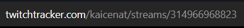
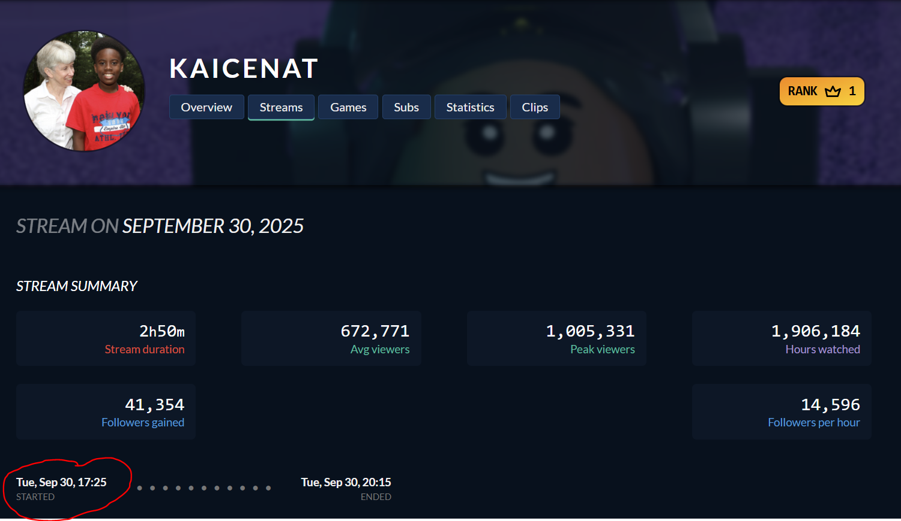
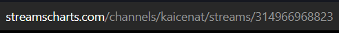
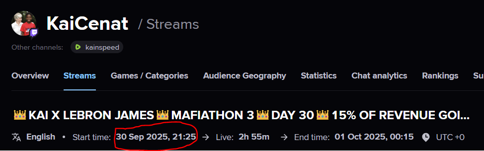
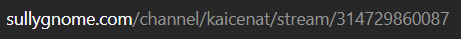
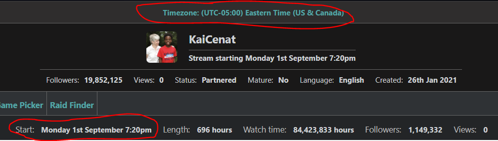

# Prerequisites

Install the latest version of the [Java 8 JRE](https://www.java.com/en/) and download twitch-m3u8-guesser.jar.

# What is this?

This is a tool I created to help people find the m3u8 links for Twitch streams. It's designed to be used in conjunction with the Chrome Extension [Twitch VOD Downloader](https://chromewebstore.google.com/detail/twitch-vod-downloader/gaabmdjigfcnkgeommfpnoinpdmpfhaj?hl=en).

# How do I use it?

If I've done everything right, you should just be able to double-click the JAR file and input the correct information into the boxes. After a brief wait the m3u8 link(s) for the vod you want should appear (assuming it exists).

# You mentioned correct information, what is that?

You need 3 things: Someone's twitch username, the date of the stream you want to find the vod for, and the stream id of that stream.

# Where can I find this info?

You can find it on websites such as [twitchtracker](https://twitchtracker.com/), [sullygnome](https://sullygnome.com/), or [streamscharts](https://streamscharts.com/).

A twitchtracker url is formatted as twitchtracker.com/[USERNAME]/streams.[STREAMID]. You can find the start time of the stream below the "stream summary" section.

A streamscharts url is formatted as streamscharts.com/channels/[USERNAME]/streams/[STREAMID]. You can find the start time at the top of the page under the stream title. Streamscharts provides the start time in UTC (+0), so you will need to convert it into your local timezone for the tool to work correctly.

A sullygnome url is formatted as sullygnome.com/channel/[USERNAME]/stream/[STREAMID]. You can find the start time of the stream at the top of the page above the section with viewership information. Sullygnome will tell you what timezone it's displaying times in at the very top of the page, you can change this to display times in your timezone.

Whichever website you choose to get information from, the timestamp must match one of their formats exactly or else the tool may not work properly.

# Okay, so I have the m3u8 link, what do I do with it?

Simply copy and paste it into the box labeled "View/Download with m3u8 link" in the extension, or [open it as a network stream in VLC media player](https://youtu.be/lxyKIWGqP00?t=13).
